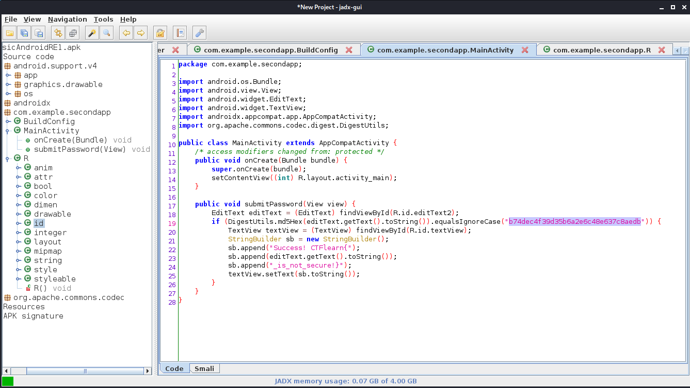

# Basic Android RE 1

* **Category:** Reverse Engineering
* **Points:** 10
* **Level:** Easy

## [Challenge](https://ctflearn.com/challenge/962)

> A simple APK, reverse engineer the logic, recreate the flag, and submit!  
> [BasicAndroidRE1.apk](BasicAndroidRE1.apk)

## Solution
We need to reverse engineer attached .apk file and found the flag.
I am using OS Kali linux and the tool called jadx. The GUI version.
The following picture is showing the screenshot of the app itself with  
eveyrthing we need to capture the flag.

We see the first third and the last third if the flag already there.  
The next task is to decypher the second third of the flag. It is  
located in the if condition as a MD5 hash.  

For this task I am using https://www.md5online.org/md5-decrypt.html online tool.  
All you need to do is to copy string in quotes and paste it there.

## FLAG
> **CTFlearn{Spring2019_is_not_secure!}**
